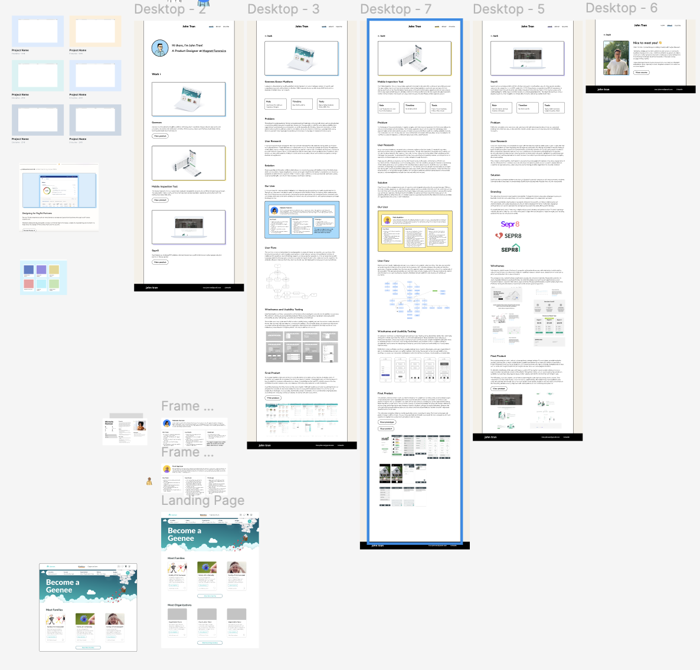
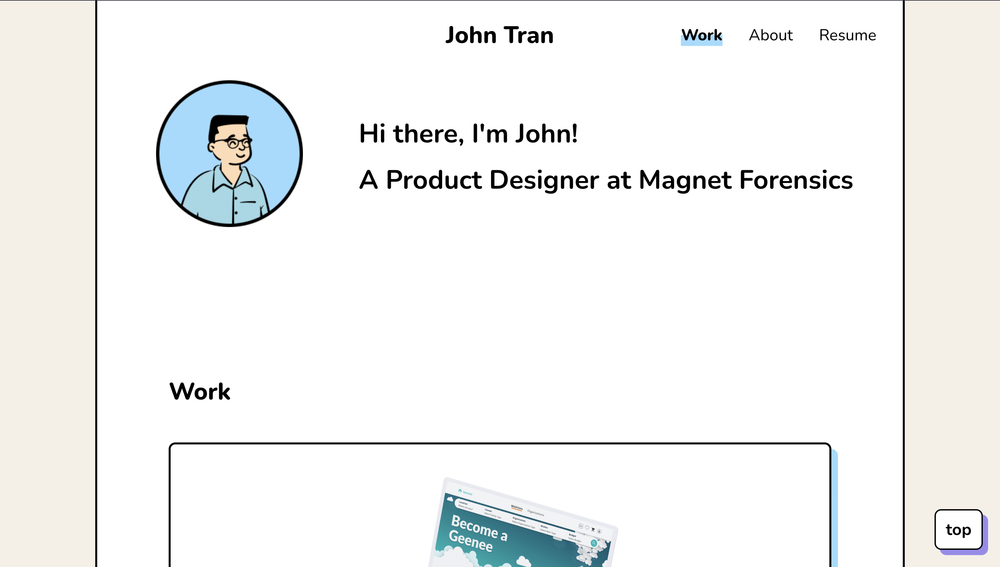
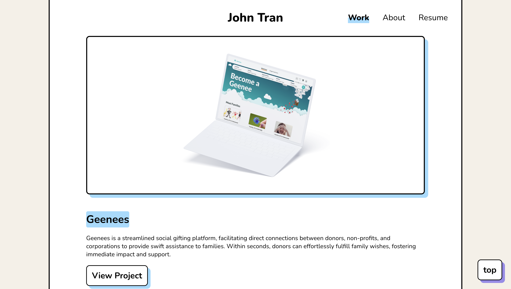
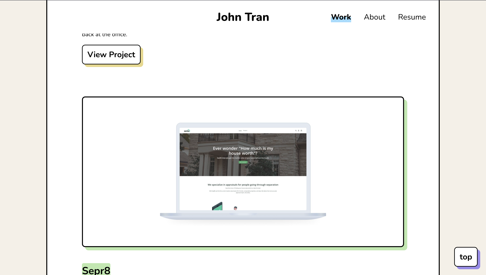
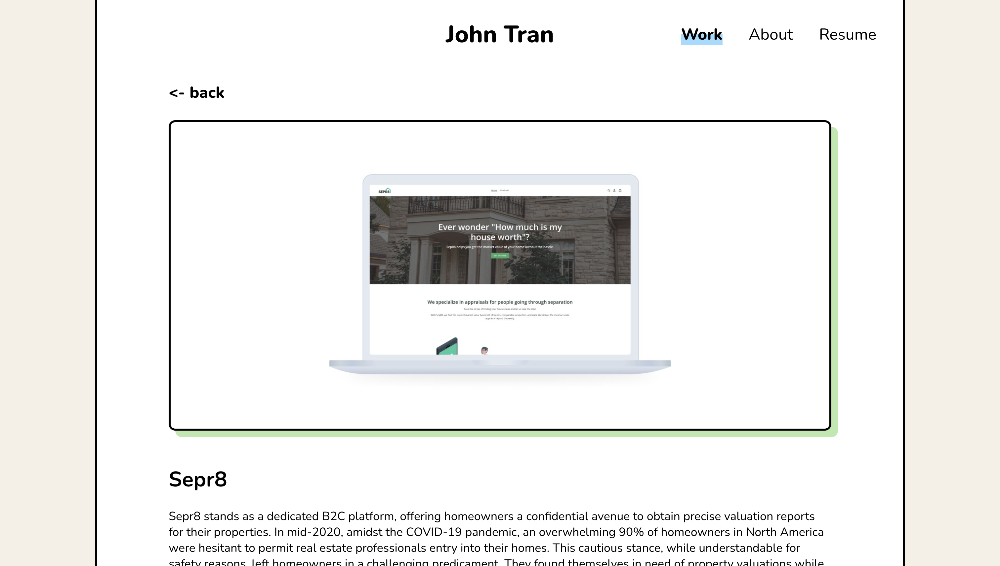
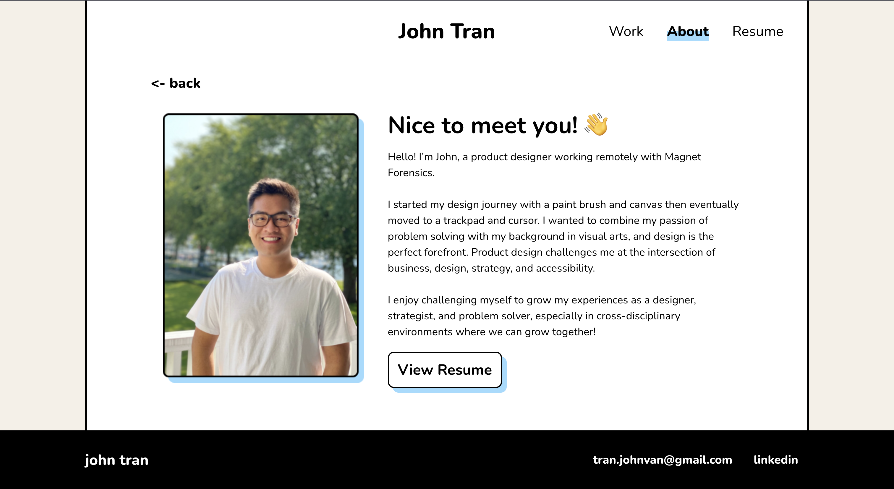
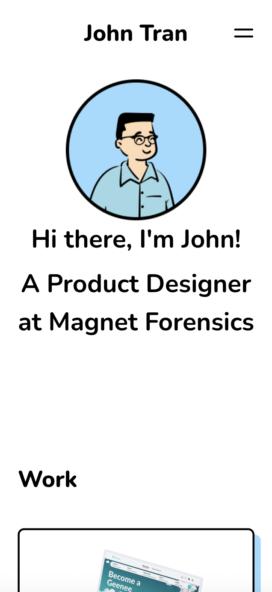
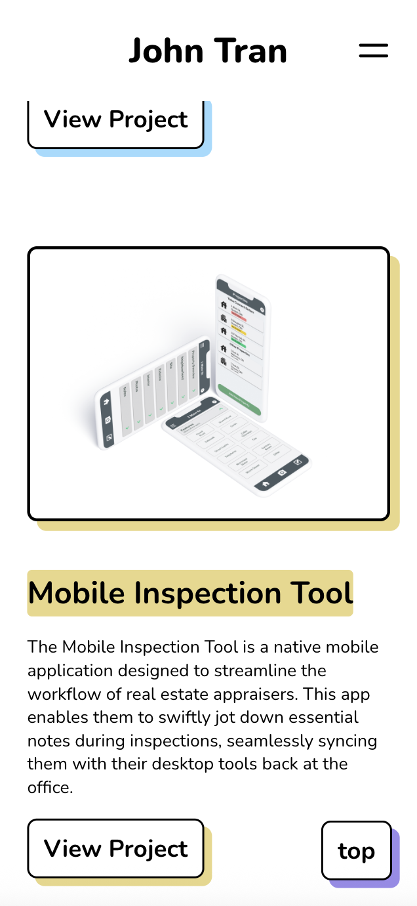
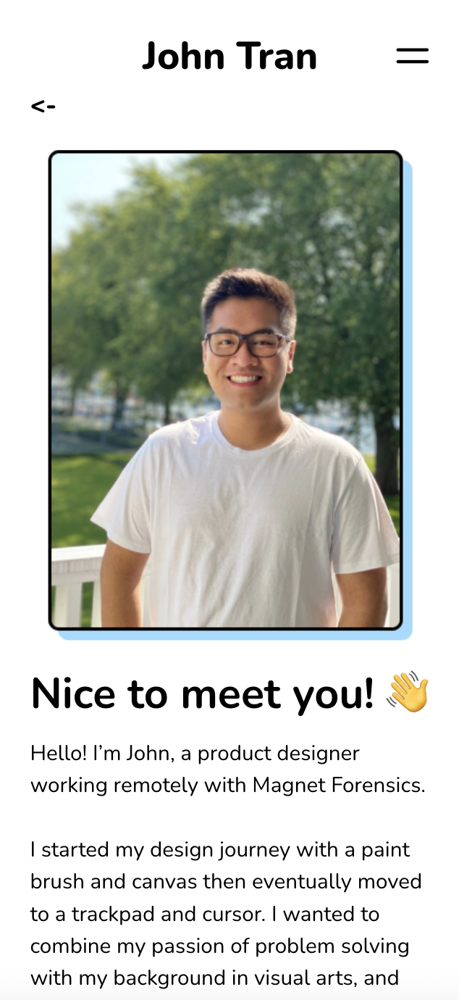

# Client Portfolio Website

A responsive portfolio website built from a Figma design provided by the client.

## Demo

[View My Version (GitHub Pages)](https://anthphan.github.io/john/)
_This is the deployed version of the site I built. The original client site is no longer live._

## About the Project

This site was built for a client based on a custom Figma design. It was used for about a year before the client decided to explore creating their own version. It showcases my ability to turn a design into a clean, fully responsive website.

## Features

- Fully responsive design
- Clean layout and modern styling
- Built with HTML, CSS, and JavaScript
- Mobile friendly adjustments
- Smooth scroll navigation

## Screenshots

### Figma Design (Reference)

_Original design provided by the client in Figma_

### Home Page - Hero Section

_Intro section with logo and navigation_

### Home Page - Projects Preview

_Showcase of recent work, further down the page_

### Project Page - Detailed View

_Expanded view of an individual project_

### About Section

_Bio and personal background_

### Mobile View

_Responsive layout for smaller screens_

  
  
  

